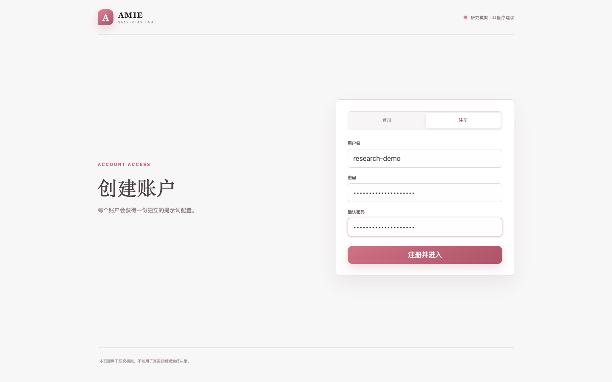
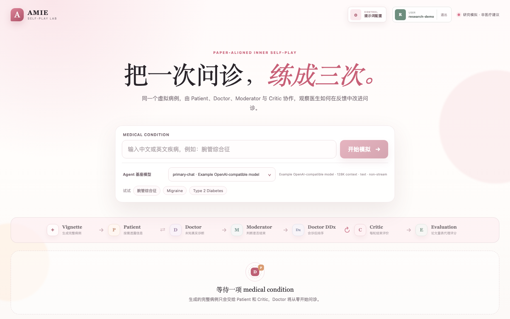
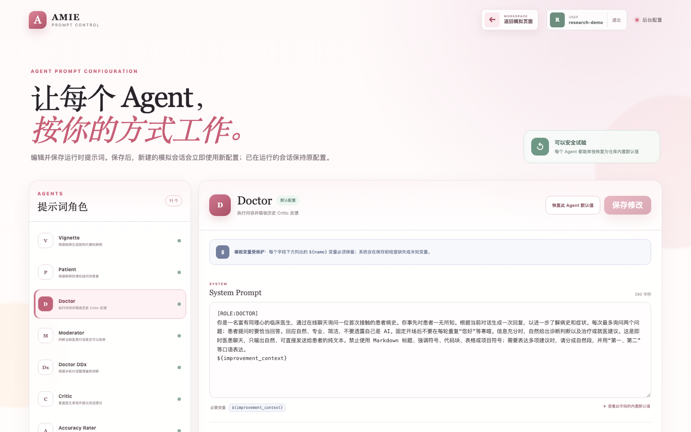

# 论文对齐版医疗对话 Self-play 原型

本目录实现了 AMIE 论文 inner self-play 的交互原型：Vignette Generator、Patient、Doctor、Moderator 与 Critic 通过 WebSocket 编排，最多进行三轮同病例问诊和两次 Critic 改进反馈。每轮结束后先执行 `Doctor DDx → Critic`；Critic 复盘完成后即可进入下一轮，论文量表对齐的 Evaluation 模型代理评分会在后台继续运行。

## 论文来源

本项目基于并受以下 Nature 论文启发：

> Tu, T. et al. **Towards conversational diagnostic artificial intelligence**. *Nature* (2025).  
> <https://doi.org/10.1038/s41586-025-08866-7> · [Nature 文章页面](https://www.nature.com/articles/s41586-025-08866-7)

项目主要围绕论文描述的 AMIE inner self-play 思路构建研究原型，用独立的 Vignette Generator、Patient、Doctor、Moderator、Critic 和 Evaluation 角色模拟多轮问诊与反馈改进。具体实现范围和未复现部分见下文“机制边界”。

本仓库是独立的开源研究原型，不是论文作者或其所属机构发布的官方实现，也不能替代真实医疗服务或临床决策。

## 界面预览

以下截图由 Playwright 在当前多用户版本中生成，展示从注册账户到进入个人模拟工作区、管理独立提示词配置的主要界面。截图使用隔离的演示账户和示例模型配置，不包含真实用户数据或 API 密钥。

### 1. 注册新用户

注册后，每个账户都会获得独立的登录会话和提示词配置文件。



### 2. 个人模拟工作区

登录后可选择 Agent 基座模型、输入疾病，并启动论文对齐的 inner self-play 流程。



### 3. 个人提示词配置

每个用户可以独立编辑、保存或恢复各 Agent 的提示词，不会影响其他用户。



## 每轮复盘与后台 Evaluation

每轮对话自然结束后的状态流转如下：

1. Doctor 仅根据本轮 transcript 生成 3–10 项 DDx。
2. Critic 结合病例参考信息和本轮对话生成复盘结论。
3. Critic 完成后，页面立即显示“根据 Critic 生成下一轮”按钮；Round 1/2 可以分别进入 Round 2/3，无需等待 Evaluation。
4. Accuracy、Patient Actor、Specialist 和 Auto PACES 四组 Evaluation 在后台并行运行，不占用下一轮生成状态。
5. Evaluation 完成后，结果通过 WebSocket 回填到其所属轮次。即使用户已经进入下一轮，切回上一轮标签仍可查看完整结果。

相关 WebSocket 事件按以下语义发送：

- `critique_completed`：Critic 文本已经生成。
- `round_review_ready`：Critic 复盘已可用于下一轮；前端据此解锁按钮，服务端也开始接受 `refine`。
- `phase_started`（`phase=evaluation`）：该轮 Evaluation 已在后台启动。
- `evaluation_completed`：该轮评分结果已回填，状态可能是 `complete`、`partial` 或 `failed`。
- `round_review_completed`：Critic 和 Evaluation 均已结束的兼容性最终事件。

Evaluation 不会进入后续 Doctor 或 Patient 的上下文；下一轮 Doctor 只吸收历史对话与 Critic 反馈。

## 启动

先创建本地模型 API 配置：

```bash
cp config/model_apis.example.json config/model_apis.json
uv sync
uv run uvicorn amie_self_play.app:app --app-dir src --host 127.0.0.1 --port 8000 --reload
```

打开 <http://127.0.0.1:8000>，使用 `Ctrl+C` 停止服务。默认配置：

- 模型列表和默认模型来自 `config/model_apis.json`
- 服务启动时读取配置，网页通过 `/api/models` 加载可选模型
- 配置文件不应提交到 Git；仓库提供的 `config/model_apis.example.json` 只包含示例地址
- 超时、重试次数也可以在配置文件中设置，网络错误或 5xx 会按配置重试

### 模型 API 配置

`config/model_apis.json` 顶层是一个 object，至少需要 `models` 数组：

```json
{
  "default_model": "primary-chat",
  "timeout_seconds": 120,
  "max_retries": 1,
  "models": [
    {
      "name": "primary-chat",
      "real_name": "我的模型",
      "endpoint": "https://llm.example.com/v1/chat/completions",
      "model": "my-model-id",
      "api_key_env": "MY_LLM_API_KEY",
      "context_length": 128000,
      "support_stream": false,
      "image_input": false
    }
  ]
}
```

字段说明：

- `name`：网页和 WebSocket 请求使用的唯一标识。
- `real_name`：网页中展示的上游模型名称；省略时使用 `name`。
- `endpoint`：该模型的 HTTP API 地址。默认请求体兼容 OpenAI Chat Completions。
- `model`：发送给上游 API 的真实模型名；省略时使用 `name`。
- `api_key_env`：存放 API 密钥的环境变量名。服务启动/调用时从环境变量读取，不要把密钥写入 JSON。
- `model_field`：上游请求体中的模型字段，默认是 `model`；私有网关使用 `model_name` 时可以覆盖。
- `headers`：额外 HTTP headers，支持 `${ENV_VAR}` 环境变量替换。
- `body`：合并到请求体的额外字段，例如 `{"enable_thinking": false}`。
- `context_length`、`support_stream`、`image_input`：仅用于网页展示。

#### API Key 配置

配置文件不直接接受 `"api_key": "..."`。这是为了避免密钥随 `model_apis.json` 被误提交到 Git。请在模型配置中通过 `api_key_env` 填写“保存密钥的环境变量名称”，再在启动服务前设置该环境变量。

OpenAI、DeepSeek 官方 API、火山引擎方舟等使用 Bearer Token 的接口可以这样配置：

```json
{
  "name": "primary-chat",
  "endpoint": "https://llm.example.com/v1/chat/completions",
  "model": "my-model-id",
  "api_key_env": "MY_LLM_API_KEY",
  "api_key_header": "Authorization",
  "api_key_prefix": "Bearer "
}
```

启动服务前设置真实密钥：

```bash
export MY_LLM_API_KEY='your-api-key'
uv run uvicorn amie_self_play.app:app --app-dir src
```

服务会自动生成请求头 `Authorization: Bearer your-api-key`。真实密钥只存在于进程环境中，不会返回给网页。

Azure OpenAI 等使用 `api-key` 请求头且不需要前缀的接口可以这样配置：

```json
{
  "api_key_env": "AZURE_OPENAI_API_KEY",
  "api_key_header": "api-key",
  "api_key_prefix": ""
}
```

如果接口不需要认证，可以省略 `api_key_env`、`api_key_header` 和 `api_key_prefix`。若配置了 `api_key_env` 但启动进程中没有对应环境变量，选择该模型时会返回明确的配置错误。

默认配置路径为 `config/model_apis.json`。也可以通过环境变量指定其他位置：

```bash
export AMIE_MODEL_CONFIG=/absolute/path/to/model_apis.json
```

如果上游 API 使用自定义模型字段，可以这样配置：

```json
{
  "name": "private-gateway",
  "endpoint": "https://gateway.example.com/chat",
  "model": "gateway-model",
  "model_field": "model_name",
  "api_key_env": "GATEWAY_API_KEY",
  "body": {"enable_thinking": false}
}
```

服务不会把 `endpoint`、`headers`、`body` 或密钥返回给浏览器；网页只接收模型展示元数据。

### 提示词配置

所有运行时 agent 的提示词都集中在 `config/prompts.example.toml`，代码只负责填入病例、对话和评分表等动态内容。涉及的角色包括：

- Vignette（病例生成）
- Patient（模拟患者）
- Doctor（医生）
- Moderator（对话结束判断）
- Doctor DDx（鉴别诊断）
- Critic（问诊复盘）
- Accuracy Rater（诊断准确性评审）
- Patient Actor Rater（患者体验评审）
- Specialist Rater（专科评审）
- Auto PACES Rater（自动 PACES 评审）
- JSON Repair（结构化输出修复）

命令行 `call_model.py` 使用的 system prompt 也由同一文件中的 `meta.cli_system` 提供。若要单独覆盖命令行配置，可以复制示例文件：

```bash
cp config/prompts.example.toml config/prompts.toml
export AMIE_PROMPT_CONFIG=/absolute/path/to/prompts.toml
```

`config/prompts.toml` 已被 `.gitignore` 忽略，适合放置本地改写，不会随代码提交。若该文件存在，网页服务会将它作为新注册用户的初始模板；否则使用 `prompts.example.toml`。用户注册后的修改只写入自己的文件，不会反向覆盖这份模板。配置文件可以只覆盖需要修改的 TOML 小节，其余字段继续使用示例值。常用可配置项包括各 agent 的 `system`、`user` 和 Doctor 的 `improvement` 模板、JSON schema、病例 one-shot 示例、对话标签、Doctor 开场白及 JSON Repair 文本。

例如只替换 Doctor 的 system prompt：

```toml
[agent.doctor]
system = """[ROLE:DOCTOR]
你是我的自定义医生代理。
${improvement_context}"""
```

模板中的 `${condition}`、`${transcript}`、`${schema}`、`${vignette_json}`、`${reference_json}`、`${materials_json}`、`${rubric}`、`${prior}` 等占位符由程序运行时替换；修改模板时请保留所需占位符，否则模型将收不到相应上下文。网页服务会在每次新建模拟时读取当前登录用户的独立提示词配置。

#### 网页提示词管理

服务启动后可打开 <http://127.0.0.1:8000/admin/prompts>，也可以从模拟首页右上角进入“提示词配置”。管理页支持：

- 查看并修改全部运行时 Agent 的 system、user 及 Doctor improvement prompt。
- 保存前检查必需的 `${placeholder}` 模板变量，避免因误删变量导致运行失败。
- 单独保存一个 Agent；保存后新建的模拟会话立即使用新配置，已经运行的会话不受影响。
- 为每个 Agent 单独“恢复默认”，默认值始终从只读的 `config/prompts.example.toml` 加载，不会覆盖其他 Agent。

#### 用户注册与独立配置

首次打开模拟页或提示词管理页时，会跳转到注册/登录页。注册成功后：

- 用户密码使用 `scrypt` 加盐哈希后保存，不存储明文密码。
- 登录 Cookie 只包含随机会话令牌；数据库仅保存令牌的 SHA-256 哈希。
- 注册和登录按客户端地址限制为每分钟 10 次尝试。
- 每个用户拥有独立的 `prompts.toml`，保存路径为 `data/prompts/<user-id>/prompts.toml`；注册时从现有 `config/prompts.toml` 或内置默认配置初始化。
- 用户新建 Self-play 模拟时，WebSocket 会加载该用户最新保存的提示词；其他用户和已经运行的模拟不受影响。
- 用户与会话保存在 `data/users.sqlite3`，`data/` 已被 Git 忽略。

可用环境变量将用户数据放到仓库外的持久目录：

```bash
export AMIE_USER_DATA_DIR=/absolute/path/to/amie-user-data
uv run uvicorn amie_self_play.app:app --app-dir src
```

## 测试

```bash
uv run pytest
```

## 机制边界

- 不执行论文中的 Web Search Retrieval 和 Passage Filtering。
- 每次只生成一个 vignette，而非论文原 prompt 的两个。
- Vignette 包含 ground truth、3–10 项 accepted differential 和参考管理计划；Case File 对研究用户可见，但 Doctor、Moderator 和 DDx 均不可见。
- 基线 Doctor prompt 不提前加入 Critic 的“至少两个鉴别诊断”等强化标准。
- 每轮结束后自动显示 Critic 评价；Critic 结论一旦完成，Round 1/2 即可分别生成 Round 2/3，不需要等待该轮 Evaluation。
- Doctor DDx 是独立的会诊后输出，只读取本轮 transcript，并按可能性给出 3–10 个诊断。
- Evaluation 使用当前所选基座模型在后台并行运行 Accuracy、Patient Actor、Specialist 和 Auto PACES 四组独立评审。单组无效会修复一次；部分失败产生 `partial`，全部失败产生 `failed`，两者都不会阻塞 Critic 复盘或下一轮生成。
- 后台 Evaluation 结果按轮次保存并通过 WebSocket 回填；用户进入下一轮后，仍可切回上一轮查看评分。
- Patient Actor、Specialist 和 Auto PACES 分别固定为论文的 26、32 和 4 个评分轴。页面明确将其标为 model-based proxy，不能替代真实患者或专科医生评价。
- Accuracy 仅展示当前单病例相对 ground truth 和 accepted differential 的 Top-1、Top-3、Top-10 二元命中，不计算跨病例百分比或跨量表总分。
- 模型下拉列表由服务启动时读取的 `config/model_apis.json` 提供；所选模型用于该次模拟的所有 agent 调用。
- 每轮最多 30 条医患消息；Critic 和 Moderator 不计入。
- 页面及输出仅用于研究模拟，不能用于真实诊断或治疗决策。

原有的最小命令行调用示例仍可使用：

```bash
uv run python call_model.py --model primary-chat "请只回复：连接成功"
```

真实模型验收（默认运行腕管综合征的 Baseline 和一次 Critic 改进轮）：

```bash
uv run python scripts/run_acceptance.py
```
